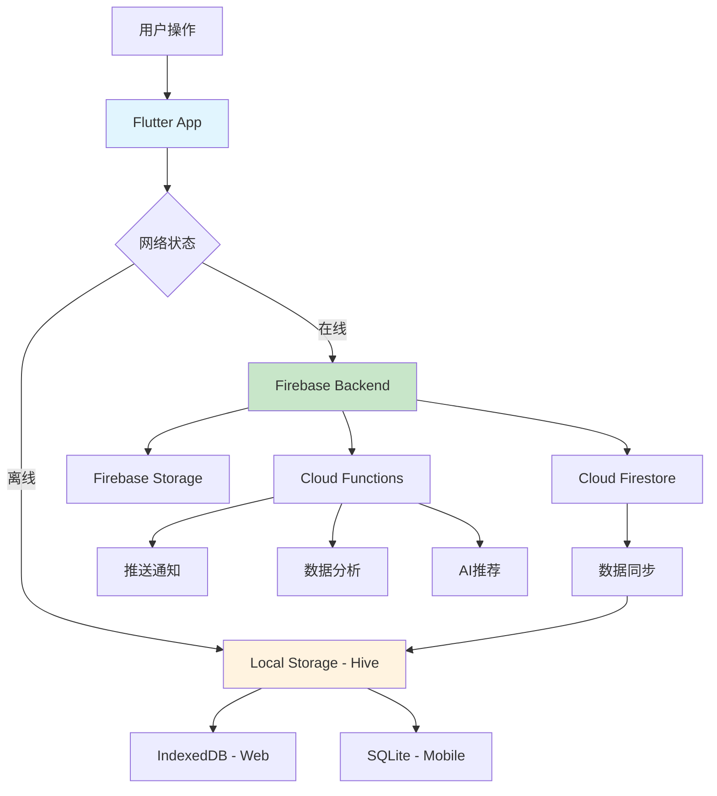

# 爱心食谱 - 后端架构与数据流通设计文档

> Firebase + Flutter 全栈架构设计 | 最后更新: 2025-01-30

## 🏗️ 系统架构概览

### 技术栈选择

```
Frontend (Flutter)          Backend (Firebase)         Storage & Analytics
    │                           │                          │
    ├── Flutter Web/Mobile      ├── Firebase Auth         ├── Cloud Firestore
    ├── Riverpod (状态管理)     ├── Cloud Functions       ├── Firebase Storage
    ├── Hive (本地缓存)         ├── Firebase Security     ├── Google Analytics
    └── GoRouter (路由)         └── Firebase Hosting      └── Crashlytics
```

### 核心设计原则

1. **离线优先** - 本地存储为主，云端同步为辅
2. **渐进式加载** - 数据按需加载，避免一次性拉取
3. **冲突解决** - 自动合并机制处理多设备数据冲突
4. **隐私保护** - 用户数据端到端加密，情侣数据权限隔离
5. **性能优化** - 缓存策略 + 预加载机制

---

## 📊 数据模型设计

### 1. 用户数据模型 (User Model)

```typescript
// Firebase Firestore Collection: /users/{userId}
interface AppUser {
  // 基础信息
  uid: string;                    // Firebase UID (主键)
  email: string;                  // 邮箱地址
  displayName?: string;           // 显示名称
  photoURL?: string;              // 头像 URL
  phoneNumber?: string;           // 手机号码
  
  // 时间戳
  createdAt: Timestamp;           // 账号创建时间
  updatedAt: Timestamp;           // 最后更新时间
  lastActiveAt: Timestamp;        // 最后活跃时间
  
  // 偏好设置
  preferences: {
    isDarkMode: boolean;          // 深色模式
    enableNotifications: boolean; // 推送通知
    enableCookingReminders: boolean; // 烹饪提醒
    preferredDifficulty: string;  // 默认难度偏好
    preferredServings: number;    // 默认份量偏好
    language: string;             // 语言设置
    userTags: string[];           // 口味标签
  };
  
  // 情侣绑定
  coupleBinding?: {
    partnerId: string;            // 伴侣用户 ID
    partnerName: string;          // 伴侣昵称
    coupleId: string;             // 情侣组 ID
    bindingDate: Timestamp;       // 绑定时间
    intimacyLevel: number;        // 亲密度等级
    cookingTogether: number;      // 共同烹饪次数
  };
  
  // 用户统计
  stats: {
    level: number;                // 用户等级
    experience: number;           // 经验值
    recipesCreated: number;       // 创建菜谱数
    cookingCompleted: number;     // 完成烹饪次数
    consecutiveDays: number;      // 连续使用天数
    achievements: string[];       // 成就列表
  };
  
  // 隐私设置
  privacy: {
    shareRecipesToPublic: boolean; // 公开分享菜谱
    shareStatsToPartner: boolean;  // 与伴侣分享统计
    allowPartnerEdit: boolean;     // 允许伴侣编辑
  };
}
```

### 2. 菜谱数据模型 (Recipe Model)

```typescript
// Firebase Firestore Collection: /recipes/{recipeId}
interface Recipe {
  // 基础信息
  id: string;                     // 菜谱唯一ID
  title: string;                  // 菜谱标题
  description: string;            // 菜谱描述
  
  // 媒体资源
  coverImage: string;             // 封面图片 (Base64 或 Storage URL)
  images: string[];               // 步骤图片列表
  
  // 菜谱属性
  cookingTime: number;            // 烹饪时间(分钟)
  difficulty: string;             // 难度级别 (简单/中等/困难)
  servings: number;               // 份量
  cuisine: string;                // 菜系 (川菜/粤菜/湘菜等)
  tags: string[];                 // 标签 (素食/低脂/快手等)
  
  // 制作步骤
  steps: {
    stepNumber: number;           // 步骤序号
    description: string;          // 步骤描述
    image?: string;               // 步骤图片
    duration?: number;            // 预计用时
    tips?: string;                // 小贴士
  }[];
  
  // 食材清单
  ingredients: {
    name: string;                 // 食材名称
    amount: string;               // 用量
    unit: string;                 // 单位
    category: string;             // 分类 (主料/调料/配菜)
  }[];
  
  // 营养信息
  nutrition?: {
    calories: number;             // 卡路里
    protein: number;              // 蛋白质 (g)
    carbs: number;                // 碳水化合物 (g)
    fat: number;                  // 脂肪 (g)
    fiber: number;                // 纤维 (g)
  };
  
  // 元数据
  createdBy: string;              // 创建者 UID
  createdAt: Timestamp;           // 创建时间
  updatedAt: Timestamp;           // 更新时间
  
  // 可见性控制
  visibility: 'private' | 'couple' | 'public'; // 可见性级别
  
  // 互动数据
  interactions: {
    views: number;               // 浏览次数
    likes: number;               // 点赞数
    cookAttempts: number;        // 制作尝试次数
    rating: number;              // 平均评分
    comments: string[];          // 评论 ID 列表
  };
  
  // 数据同步标记
  syncStatus: 'local' | 'synced' | 'conflict'; // 同步状态
  localVersion: number;         // 本地版本号
  cloudVersion: number;         // 云端版本号
}
```

### 3. 记忆时光数据模型 (Memory Model)

```typescript
// Firebase Firestore Collection: /memories/{memoryId}
interface Memory {
  // 基础信息
  id: string;                     // 记忆唯一ID
  title: string;                  // 记忆标题
  emoji: string;                  // 表情符号
  mood: string;                   // 心情 (温馨/浪漫/开心等)
  
  // 关联信息
  recipeId?: string;              // 关联菜谱ID
  date: Timestamp;                // 记忆日期
  location?: string;              // 地点
  
  // 内容
  description: string;            // 记忆描述
  story: string;                  // 详细故事
  photos: string[];               // 照片列表
  
  // 参与者
  participants: string[];         // 参与者 UID 列表
  createdBy: string;              // 创建者 UID
  
  // 标记
  isSpecial: boolean;             // 是否特殊记忆
  tags: string[];                 // 标签
  
  // 时间戳
  createdAt: Timestamp;
  updatedAt: Timestamp;
  
  // 可见性
  visibility: 'private' | 'couple'; // 记忆可见性
}
```

### 4. 挑战系统数据模型 (Challenge Model)

```typescript
// Firebase Firestore Collection: /challenges/{challengeId}
interface Challenge {
  // 基础信息
  id: string;                     // 挑战ID
  title: string;                  // 挑战标题
  description: string;            // 挑战描述
  
  // 关联菜谱
  recipeId: string;               // 目标菜谱ID
  recipeName: string;             // 菜谱名称
  recipeIcon: string;             // 菜谱图标
  
  // 参与者
  senderId: string;               // 发起者UID
  receiverId: string;             // 接收者UID
  
  // 状态
  status: 'pending' | 'accepted' | 'completed' | 'declined'; // 挑战状态
  
  // 时间信息
  createdAt: Timestamp;           // 创建时间
  expiresAt?: Timestamp;          // 过期时间
  completedAt?: Timestamp;        // 完成时间
  
  // 挑战参数
  difficulty: number;             // 难度级别
  estimatedTime: number;          // 预计时间
  reward?: string;                // 奖励内容
  
  // 完成证明
  completionProof?: {
    photos: string[];             // 完成照片
    notes: string;                // 制作心得
    rating: number;               // 自评分数
  };
  
  // 消息
  message?: string;               // 挑战留言
}
```

---

## 🔄 数据流通架构

### 1. 数据流向图



### 2. 读写操作流程

#### 数据写入流程

```dart
// 1. 本地优先写入
Future<void> createRecipe(Recipe recipe) async {
  try {
    // Step 1: 立即保存到本地存储
    await _hiveRepository.saveRecipe(recipe.copyWith(
      syncStatus: SyncStatus.local,
      localVersion: DateTime.now().millisecondsSinceEpoch,
    ));
    
    // Step 2: 更新 UI (立即响应)
    _updateUI(recipe);
    
    // Step 3: 后台同步到云端
    _backgroundSync(recipe);
    
  } catch (e) {
    // 失败处理：保持本地数据，标记同步失败
    _markSyncFailed(recipe.id);
  }
}

// 后台同步方法
Future<void> _backgroundSync(Recipe recipe) async {
  if (!await _networkService.isConnected) return;
  
  try {
    // 上传图片到 Firebase Storage
    final imageUrls = await _uploadImages(recipe.images);
    
    // 保存到 Firestore
    await _firestoreRepository.saveRecipe(recipe.copyWith(
      images: imageUrls,
      syncStatus: SyncStatus.synced,
      cloudVersion: DateTime.now().millisecondsSinceEpoch,
    ));
    
    // 更新本地同步状态
    await _hiveRepository.updateSyncStatus(recipe.id, SyncStatus.synced);
    
  } catch (e) {
    // 同步失败：保持本地版本，稍后重试
    _scheduleRetry(recipe.id);
  }
}
```

#### 数据读取流程

```dart
// 数据获取策略：本地缓存 + 云端同步
Future<List<Recipe>> getRecipes({bool forceRefresh = false}) async {
  try {
    // Step 1: 优先从本地缓存读取
    List<Recipe> localRecipes = await _hiveRepository.getAllRecipes();
    
    if (!forceRefresh && localRecipes.isNotEmpty) {
      // 返回本地数据，同时后台更新
      _backgroundRefresh();
      return localRecipes;
    }
    
    // Step 2: 从云端获取最新数据
    if (await _networkService.isConnected) {
      final cloudRecipes = await _firestoreRepository.getAllRecipes();
      
      // Step 3: 合并本地和云端数据
      final mergedRecipes = await _mergeData(localRecipes, cloudRecipes);
      
      // Step 4: 更新本地缓存
      await _hiveRepository.saveAllRecipes(mergedRecipes);
      
      return mergedRecipes;
    }
    
    // Step 5: 网络不可用时返回本地数据
    return localRecipes;
    
  } catch (e) {
    // 异常处理：返回本地数据作为fallback
    return await _hiveRepository.getAllRecipes();
  }
}
```

### 3. 冲突解决机制

```dart
// 数据冲突解决策略
Future<Recipe> _resolveConflict(Recipe localRecipe, Recipe cloudRecipe) async {
  // 策略1: 时间戳优先 (Last Write Wins)
  if (cloudRecipe.updatedAt.isAfter(localRecipe.updatedAt)) {
    return cloudRecipe;
  }
  
  // 策略2: 字段级合并 (Field-level Merge)
  return Recipe(
    id: localRecipe.id,
    title: _selectNewer(localRecipe.title, cloudRecipe.title, 
                       localRecipe.updatedAt, cloudRecipe.updatedAt),
    description: _selectNewer(localRecipe.description, cloudRecipe.description,
                             localRecipe.updatedAt, cloudRecipe.updatedAt),
    // 图片列表：合并去重
    images: _mergeImageLists(localRecipe.images, cloudRecipe.images),
    // 步骤：版本号高的优先
    steps: localRecipe.localVersion > cloudRecipe.cloudVersion 
           ? localRecipe.steps : cloudRecipe.steps,
    // 互动数据：累加处理
    interactions: _mergeInteractions(localRecipe.interactions, cloudRecipe.interactions),
    // 更新同步状态
    syncStatus: SyncStatus.synced,
    localVersion: DateTime.now().millisecondsSinceEpoch,
    cloudVersion: cloudRecipe.cloudVersion,
  );
}
```

---

## 🔐 用户认证与权限管理

### 1. Firebase 认证集成

```dart
// 认证服务实现
class AuthService {
  final FirebaseAuth _firebaseAuth = FirebaseAuth.instance;
  final GoogleSignIn _googleSignIn = GoogleSignIn();
  
  // 邮箱密码注册
  Future<AppUser> registerWithEmailPassword({
    required String email,
    required String password,
    String? displayName,
  }) async {
    try {
      // 1. Firebase 用户创建
      final credential = await _firebaseAuth.createUserWithEmailAndPassword(
        email: email,
        password: password,
      );
      
      // 2. 更新用户资料
      if (displayName != null) {
        await credential.user!.updateDisplayName(displayName);
      }
      
      // 3. 创建应用用户档案
      final appUser = AppUser.fromFirebaseUser(credential.user!);
      
      // 4. 保存到 Firestore
      await _firestoreService.createUserProfile(appUser);
      
      // 5. 发送邮箱验证
      await credential.user!.sendEmailVerification();
      
      return appUser;
      
    } on FirebaseAuthException catch (e) {
      throw AuthException(_getErrorMessage(e.code), e.code);
    }
  }
  
  // Google 登录
  Future<AppUser> signInWithGoogle() async {
    try {
      // 1. Google 登录流程
      final GoogleSignInAccount? googleUser = await _googleSignIn.signIn();
      if (googleUser == null) throw AuthException('登录已取消', 'CANCELLED');
      
      // 2. 获取认证凭据
      final GoogleSignInAuthentication googleAuth = await googleUser.authentication;
      final credential = GoogleAuthProvider.credential(
        accessToken: googleAuth.accessToken,
        idToken: googleAuth.idToken,
      );
      
      // 3. Firebase 登录
      final userCredential = await _firebaseAuth.signInWithCredential(credential);
      
      // 4. 创建或更新用户档案
      final appUser = AppUser.fromFirebaseUser(userCredential.user!);
      await _firestoreService.createOrUpdateUserProfile(appUser);
      
      return appUser;
      
    } catch (e) {
      throw AuthException('Google登录失败', 'GOOGLE_SIGN_IN_FAILED');
    }
  }
}
```

### 2. 数据权限控制

```javascript
// Firestore Security Rules
rules_version = '2';
service cloud.firestore {
  match /databases/{database}/documents {
    
    // 用户档案权限
    match /users/{userId} {
      allow read, write: if request.auth != null && request.auth.uid == userId;
    }
    
    // 菜谱权限
    match /recipes/{recipeId} {
      allow read: if resource.data.visibility == 'public' 
                  || request.auth.uid == resource.data.createdBy
                  || (resource.data.visibility == 'couple' 
                      && isCouplePartner(request.auth.uid, resource.data.createdBy));
      
      allow write: if request.auth != null 
                   && (request.auth.uid == resource.data.createdBy
                       || (resource.data.visibility == 'couple' 
                           && isCouplePartner(request.auth.uid, resource.data.createdBy)
                           && allowPartnerEdit(request.auth.uid)));
    }
    
    // 记忆权限
    match /memories/{memoryId} {
      allow read, write: if request.auth != null 
                         && (request.auth.uid in resource.data.participants);
    }
    
    // 挑战权限
    match /challenges/{challengeId} {
      allow read, write: if request.auth != null 
                         && (request.auth.uid == resource.data.senderId 
                             || request.auth.uid == resource.data.receiverId);
    }
    
    // 辅助函数
    function isCouplePartner(userId, targetUserId) {
      let userDoc = get(/databases/$(database)/documents/users/$(userId));
      return userDoc != null 
             && userDoc.data.coupleBinding != null
             && userDoc.data.coupleBinding.partnerId == targetUserId;
    }
    
    function allowPartnerEdit(userId) {
      let userDoc = get(/databases/$(database)/documents/users/$(userId));
      return userDoc != null 
             && userDoc.data.privacy.allowPartnerEdit == true;
    }
  }
}
```

---

## 📱 用户数据导入导出系统

### 1. 数据导出功能

```dart
// 数据导出服务
class DataExportService {
  // 导出用户所有数据
  Future<ExportResult> exportAllUserData() async {
    try {
      final currentUser = await _authService.getCurrentUser();
      if (currentUser == null) throw Exception('用户未登录');
      
      // 1. 收集用户数据
      final exportData = UserExportData(
        userProfile: currentUser,
        recipes: await _recipeService.getUserRecipes(currentUser.uid),
        memories: await _memoryService.getUserMemories(currentUser.uid),
        challenges: await _challengeService.getUserChallenges(currentUser.uid),
        achievements: await _achievementService.getUserAchievements(currentUser.uid),
        exportDate: DateTime.now(),
        exportVersion: '1.0.0',
      );
      
      // 2. 数据序列化
      final jsonData = exportData.toJson();
      
      // 3. 压缩处理
      final compressedData = await _compressionService.compress(jsonData);
      
      // 4. 生成文件
      final fileName = 'love_recipe_backup_${DateTime.now().millisecondsSinceEpoch}.json';
      
      // 5. 平台特定保存
      if (kIsWeb) {
        return await _saveToWebDownload(compressedData, fileName);
      } else {
        return await _saveToMobileStorage(compressedData, fileName);
      }
      
    } catch (e) {
      throw ExportException('导出失败: ${e.toString()}');
    }
  }
  
  // Web平台文件下载
  Future<ExportResult> _saveToWebDownload(List<int> data, String fileName) async {
    final bytes = Uint8List.fromList(data);
    final blob = html.Blob([bytes]);
    final url = html.Url.createObjectUrlFromBlob(blob);
    
    final anchor = html.AnchorElement(href: url)
      ..setAttribute('download', fileName)
      ..click();
    
    html.Url.revokeObjectUrl(url);
    
    return ExportResult(
      success: true,
      filePath: fileName,
      fileSize: data.length,
      message: '数据已下载到本地',
    );
  }
  
  // 移动端文件保存
  Future<ExportResult> _saveToMobileStorage(List<int> data, String fileName) async {
    final directory = await getApplicationDocumentsDirectory();
    final filePath = '${directory.path}/$fileName';
    final file = File(filePath);
    
    await file.writeAsBytes(data);
    
    // 分享文件选项
    await Share.shareFiles([filePath], text: '爱心食谱数据备份');
    
    return ExportResult(
      success: true,
      filePath: filePath,
      fileSize: data.length,
      message: '数据已保存并可分享',
    );
  }
}

// 导出数据模型
class UserExportData {
  final AppUser userProfile;
  final List<Recipe> recipes;
  final List<Memory> memories;
  final List<Challenge> challenges;
  final List<Achievement> achievements;
  final DateTime exportDate;
  final String exportVersion;
  
  // 数据完整性校验
  String get checksum => _calculateChecksum();
  
  Map<String, dynamic> toJson() => {
    'meta': {
      'exportDate': exportDate.toIso8601String(),
      'exportVersion': exportVersion,
      'checksum': checksum,
      'dataTypes': ['profile', 'recipes', 'memories', 'challenges', 'achievements'],
    },
    'userProfile': userProfile.toFirestore(),
    'recipes': recipes.map((r) => r.toJson()).toList(),
    'memories': memories.map((m) => m.toJson()).toList(),
    'challenges': challenges.map((c) => c.toJson()).toList(),
    'achievements': achievements.map((a) => a.toJson()).toList(),
  };
}
```

### 2. 数据导入功能

```dart
// 数据导入服务
class DataImportService {
  // 导入用户数据
  Future<ImportResult> importUserData(String filePath) async {
    try {
      // 1. 读取文件
      final fileData = await _readImportFile(filePath);
      
      // 2. 数据验证
      final importData = await _validateImportData(fileData);
      
      // 3. 冲突检测
      final conflicts = await _detectConflicts(importData);
      
      // 4. 用户确认冲突解决策略
      final resolution = await _showConflictResolutionDialog(conflicts);
      
      // 5. 执行数据导入
      return await _executeImport(importData, resolution);
      
    } catch (e) {
      throw ImportException('导入失败: ${e.toString()}');
    }
  }
  
  // 冲突解决策略
  Future<ImportResult> _executeImport(
    UserExportData importData, 
    ConflictResolution resolution
  ) async {
    final result = ImportResult();
    
    try {
      // 开启事务
      await _firestoreService.runTransaction((transaction) async {
        
        // 导入用户档案
        if (resolution.updateProfile) {
          await _importUserProfile(importData.userProfile, transaction);
          result.profileImported = true;
        }
        
        // 导入菜谱
        for (final recipe in importData.recipes) {
          final conflictResolution = resolution.recipeResolutions[recipe.id];
          switch (conflictResolution) {
            case ConflictAction.skip:
              result.recipesSkipped++;
              break;
            case ConflictAction.overwrite:
              await _importRecipe(recipe, transaction, overwrite: true);
              result.recipesImported++;
              break;
            case ConflictAction.merge:
              await _mergeAndImportRecipe(recipe, transaction);
              result.recipesMerged++;
              break;
            case ConflictAction.createNew:
              await _importRecipe(recipe.copyWith(id: _generateNewId()), transaction);
              result.recipesImported++;
              break;
          }
        }
        
        // 导入记忆
        for (final memory in importData.memories) {
          await _importMemory(memory, transaction);
          result.memoriesImported++;
        }
        
        // 导入成就
        for (final achievement in importData.achievements) {
          await _importAchievement(achievement, transaction);
        }
        
      });
      
      // 更新本地缓存
      await _updateLocalCache(importData);
      
      result.success = true;
      result.message = '数据导入完成';
      
    } catch (e) {
      result.success = false;
      result.message = '导入过程中出现错误: ${e.toString()}';
    }
    
    return result;
  }
  
  // 数据验证
  Future<UserExportData> _validateImportData(Map<String, dynamic> jsonData) async {
    // 1. 版本兼容性检查
    final exportVersion = jsonData['meta']['exportVersion'];
    if (!_isVersionCompatible(exportVersion)) {
      throw ImportException('数据版本不兼容: $exportVersion');
    }
    
    // 2. 数据完整性校验
    final expectedChecksum = jsonData['meta']['checksum'];
    final actualChecksum = _calculateDataChecksum(jsonData);
    if (expectedChecksum != actualChecksum) {
      throw ImportException('数据完整性校验失败');
    }
    
    // 3. 数据结构验证
    _validateDataStructure(jsonData);
    
    // 4. 反序列化
    return UserExportData.fromJson(jsonData);
  }
}

// 导入结果模型
class ImportResult {
  bool success = false;
  String message = '';
  bool profileImported = false;
  int recipesImported = 0;
  int recipesSkipped = 0;
  int recipesMerged = 0;
  int memoriesImported = 0;
  int achievementsImported = 0;
  
  String get summary => '''
导入完成！
- 用户档案: ${profileImported ? '已更新' : '未更改'}
- 菜谱: 导入${recipesImported}个，跳过${recipesSkipped}个，合并${recipesMerged}个
- 记忆: 导入${memoriesImported}个
- 成就: 导入${achievementsImported}个
  ''';
}
```

### 3. 用户操作界面

```dart
// 数据管理页面
class DataManagementScreen extends ConsumerWidget {
  @override
  Widget build(BuildContext context, WidgetRef ref) {
    return Scaffold(
      appBar: AppBar(title: Text('数据管理')),
      body: Padding(
        padding: EdgeInsets.all(16),
        child: Column(
          children: [
            // 数据导出卡片
            _buildExportCard(context, ref),
            SizedBox(height: 16),
            
            // 数据导入卡片
            _buildImportCard(context, ref),
            SizedBox(height: 16),
            
            // 数据统计卡片
            _buildDataStatsCard(context, ref),
            SizedBox(height: 16),
            
            // 云端同步状态
            _buildSyncStatusCard(context, ref),
          ],
        ),
      ),
    );
  }
  
  Widget _buildExportCard(BuildContext context, WidgetRef ref) {
    return Card(
      child: Padding(
        padding: EdgeInsets.all(16),
        child: Column(
          crossAxisAlignment: CrossAxisAlignment.start,
          children: [
            Row(
              children: [
                Icon(Icons.file_download, color: Colors.blue),
                SizedBox(width: 8),
                Text('数据导出', style: TextStyle(fontSize: 18, fontWeight: FontWeight.bold)),
              ],
            ),
            SizedBox(height: 8),
            Text('将您的所有数据（菜谱、记忆、成就等）导出为备份文件'),
            SizedBox(height: 16),
            
            Row(
              children: [
                Expanded(
                  child: ElevatedButton.icon(
                    onPressed: () => _handleExport(context, ref, ExportType.all),
                    icon: Icon(Icons.backup),
                    label: Text('导出全部数据'),
                  ),
                ),
                SizedBox(width: 8),
                Expanded(
                  child: OutlinedButton.icon(
                    onPressed: () => _showExportOptionsDialog(context, ref),
                    icon: Icon(Icons.tune),
                    label: Text('自定义导出'),
                  ),
                ),
              ],
            ),
          ],
        ),
      ),
    );
  }
  
  Widget _buildImportCard(BuildContext context, WidgetRef ref) {
    return Card(
      child: Padding(
        padding: EdgeInsets.all(16),
        child: Column(
          crossAxisAlignment: CrossAxisAlignment.start,
          children: [
            Row(
              children: [
                Icon(Icons.file_upload, color: Colors.green),
                SizedBox(width: 8),
                Text('数据导入', style: TextStyle(fontSize: 18, fontWeight: FontWeight.bold)),
              ],
            ),
            SizedBox(height: 8),
            Text('从备份文件恢复您的数据，支持智能冲突解决'),
            SizedBox(height: 16),
            
            ElevatedButton.icon(
              onPressed: () => _handleImport(context, ref),
              icon: Icon(Icons.restore),
              label: Text('选择备份文件导入'),
              style: ElevatedButton.styleFrom(
                backgroundColor: Colors.green,
                minimumSize: Size(double.infinity, 40),
              ),
            ),
          ],
        ),
      ),
    );
  }
}
```

---

## 🔄 数据同步机制

### 1. 实时同步策略

```dart
// 实时数据同步管理器
class RealtimeSyncManager {
  final FirebaseFirestore _firestore = FirebaseFirestore.instance;
  final HiveRepository _localRepository = HiveRepository();
  final StreamController<SyncEvent> _syncEventController = StreamController.broadcast();
  
  // 监听云端数据变化
  void startRealtimeSync(String userId) {
    // 监听用户菜谱变化
    _firestore
        .collection('recipes')
        .where('createdBy', isEqualTo: userId)
        .snapshots()
        .listen(_handleRecipeChanges);
    
    // 监听情侣共享数据变化
    _listenToCoupleDataChanges(userId);
    
    // 监听挑战和通知
    _listenToChallengeChanges(userId);
  }
  
  // 处理菜谱数据变化
  void _handleRecipeChanges(QuerySnapshot snapshot) async {
    for (final change in snapshot.docChanges) {
      final recipe = Recipe.fromFirestore(
        change.doc.data() as Map<String, dynamic>,
        change.doc.id,
      );
      
      switch (change.type) {
        case DocumentChangeType.added:
          await _handleRecipeAdded(recipe);
          break;
        case DocumentChangeType.modified:
          await _handleRecipeModified(recipe);
          break;
        case DocumentChangeType.removed:
          await _handleRecipeRemoved(recipe.id);
          break;
      }
    }
  }
  
  // 处理菜谱新增
  Future<void> _handleRecipeAdded(Recipe recipe) async {
    // 检查本地是否存在
    final localRecipe = await _localRepository.getRecipe(recipe.id);
    
    if (localRecipe == null) {
      // 新增到本地
      await _localRepository.saveRecipe(recipe);
      _syncEventController.add(SyncEvent.recipeAdded(recipe));
    } else {
      // 可能是冲突，需要合并
      await _resolveRecipeConflict(localRecipe, recipe);
    }
  }
  
  // 处理菜谱修改
  Future<void> _handleRecipeModified(Recipe cloudRecipe) async {
    final localRecipe = await _localRepository.getRecipe(cloudRecipe.id);
    
    if (localRecipe == null) {
      // 本地不存在，直接添加
      await _localRepository.saveRecipe(cloudRecipe);
      _syncEventController.add(SyncEvent.recipeAdded(cloudRecipe));
    } else if (localRecipe.updatedAt.isBefore(cloudRecipe.updatedAt)) {
      // 云端版本更新，同步到本地
      await _localRepository.updateRecipe(cloudRecipe);
      _syncEventController.add(SyncEvent.recipeUpdated(cloudRecipe));
    } else {
      // 可能存在冲突，需要解决
      await _resolveRecipeConflict(localRecipe, cloudRecipe);
    }
  }
  
  // 批量同步机制
  Future<void> performBatchSync() async {
    final syncTasks = <Future>[];
    
    // 同步本地未同步的数据
    final localPendingRecipes = await _localRepository.getPendingSyncRecipes();
    for (final recipe in localPendingRecipes) {
      syncTasks.add(_syncRecipeToCloud(recipe));
    }
    
    // 从云端拉取最新数据
    syncTasks.add(_pullLatestDataFromCloud());
    
    // 并行执行同步任务
    await Future.wait(syncTasks);
    
    _syncEventController.add(SyncEvent.batchSyncCompleted());
  }
}
```

### 2. 离线支持机制

```dart
// 离线数据管理器
class OfflineDataManager {
  final HiveRepository _localRepository = HiveRepository();
  final ConnectivityService _connectivityService = ConnectivityService();
  final Queue<PendingOperation> _pendingOperations = Queue();
  
  // 离线操作队列
  Future<void> queueOperation(PendingOperation operation) async {
    // 添加到待处理队列
    _pendingOperations.add(operation);
    
    // 保存到本地持久化存储
    await _savePendingOperations();
    
    // 如果有网络，立即尝试执行
    if (await _connectivityService.isConnected) {
      await _processPendingOperations();
    }
  }
  
  // 处理待处理操作
  Future<void> _processPendingOperations() async {
    while (_pendingOperations.isNotEmpty) {
      final operation = _pendingOperations.removeFirst();
      
      try {
        await _executeOperation(operation);
        
        // 操作成功，从持久化存储中移除
        await _removePendingOperation(operation.id);
        
      } catch (e) {
        // 操作失败，重新加入队列
        _pendingOperations.addFirst(operation);
        
        // 更新重试次数
        operation.retryCount++;
        
        if (operation.retryCount >= 3) {
          // 超过重试次数，标记为失败
          await _markOperationAsFailed(operation);
        } else {
          // 延迟重试
          Future.delayed(Duration(seconds: operation.retryCount * 5), () {
            _processPendingOperations();
          });
        }
        
        break; // 退出处理循环，等待重试
      }
    }
  }
  
  // 执行具体操作
  Future<void> _executeOperation(PendingOperation operation) async {
    switch (operation.type) {
      case OperationType.createRecipe:
        await _firestoreService.createRecipe(operation.data as Recipe);
        break;
      case OperationType.updateRecipe:
        await _firestoreService.updateRecipe(operation.data as Recipe);
        break;
      case OperationType.deleteRecipe:
        await _firestoreService.deleteRecipe(operation.data as String);
        break;
      case OperationType.uploadImage:
        await _storageService.uploadImage(operation.data as ImageUploadData);
        break;
    }
  }
}

// 待处理操作模型
class PendingOperation {
  final String id;
  final OperationType type;
  final dynamic data;
  final DateTime createdAt;
  int retryCount;
  
  PendingOperation({
    required this.id,
    required this.type,
    required this.data,
    required this.createdAt,
    this.retryCount = 0,
  });
}
```

---

## 🎯 性能优化策略

### 1. 数据分页加载

```dart
// 分页加载管理器
class PaginatedDataLoader<T> {
  final int pageSize;
  final Future<List<T>> Function(int limit, DocumentSnapshot? startAfter) loadFunction;
  
  DocumentSnapshot? _lastDocument;
  bool _hasMoreData = true;
  bool _isLoading = false;
  
  PaginatedDataLoader({
    required this.pageSize,
    required this.loadFunction,
  });
  
  // 加载下一页数据
  Future<List<T>> loadNextPage() async {
    if (_isLoading || !_hasMoreData) return [];
    
    _isLoading = true;
    
    try {
      final data = await loadFunction(pageSize, _lastDocument);
      
      if (data.length < pageSize) {
        _hasMoreData = false;
      }
      
      if (data.isNotEmpty && data.last is DocumentSnapshot) {
        _lastDocument = data.last as DocumentSnapshot;
      }
      
      return data;
      
    } finally {
      _isLoading = false;
    }
  }
  
  // 重置分页状态
  void reset() {
    _lastDocument = null;
    _hasMoreData = true;
    _isLoading = false;
  }
}

// 使用示例
class RecipeListService {
  final PaginatedDataLoader<Recipe> _loader;
  
  RecipeListService() : _loader = PaginatedDataLoader<Recipe>(
    pageSize: 20,
    loadFunction: _loadRecipesFromFirestore,
  );
  
  static Future<List<Recipe>> _loadRecipesFromFirestore(
    int limit, 
    DocumentSnapshot? startAfter
  ) async {
    Query query = FirebaseFirestore.instance
        .collection('recipes')
        .orderBy('createdAt', descending: true)
        .limit(limit);
    
    if (startAfter != null) {
      query = query.startAfterDocument(startAfter);
    }
    
    final snapshot = await query.get();
    return snapshot.docs.map((doc) => Recipe.fromFirestore(
      doc.data() as Map<String, dynamic>, 
      doc.id,
    )).toList();
  }
}
```

### 2. 图片优化策略

```dart
// 图片管理服务
class ImageManagementService {
  // 图片压缩和优化
  Future<String> optimizeAndUploadImage(
    Uint8List imageBytes, 
    String path,
    {ImageQuality quality = ImageQuality.medium}
  ) async {
    // 1. 图片压缩
    final compressedBytes = await _compressImage(imageBytes, quality);
    
    // 2. 生成多个尺寸
    final thumbnailBytes = await _generateThumbnail(compressedBytes, 150);
    final mediumBytes = await _generateMedium(compressedBytes, 800);
    
    // 3. 并行上传
    final uploadTasks = [
      _uploadToStorage(compressedBytes, '$path/original.jpg'),
      _uploadToStorage(thumbnailBytes, '$path/thumbnail.jpg'),
      _uploadToStorage(mediumBytes, '$path/medium.jpg'),
    ];
    
    final urls = await Future.wait(uploadTasks);
    
    // 4. 返回优化后的URL结构
    return _createImageUrlStructure(urls);
  }
  
  // 智能图片加载
  Widget buildOptimizedImage(
    String imageUrl, 
    {double? width, double? height}
  ) {
    return CachedNetworkImage(
      imageUrl: _selectOptimalImageUrl(imageUrl, width, height),
      placeholder: (context, url) => _buildImagePlaceholder(width, height),
      errorWidget: (context, url, error) => _buildImageError(width, height),
      // 内存缓存优化
      memCacheHeight: height?.toInt(),
      memCacheWidth: width?.toInt(),
      // 渐进式加载
      fadeInDuration: Duration(milliseconds: 300),
    );
  }
  
  // 选择最优图片尺寸
  String _selectOptimalImageUrl(String baseUrl, double? width, double? height) {
    if (width == null || height == null) return baseUrl;
    
    final maxDimension = math.max(width, height);
    
    if (maxDimension <= 150) {
      return baseUrl.replaceAll('/original.jpg', '/thumbnail.jpg');
    } else if (maxDimension <= 800) {
      return baseUrl.replaceAll('/original.jpg', '/medium.jpg');
    } else {
      return baseUrl; // 原图
    }
  }
}
```

---

## 📊 数据分析与监控

### 1. 用户行为分析

```dart
// 用户行为追踪服务
class UserAnalyticsService {
  final FirebaseAnalytics _analytics = FirebaseAnalytics.instance;
  
  // 追踪菜谱相关行为
  Future<void> trackRecipeEvent(RecipeEvent event, Recipe recipe) async {
    await _analytics.logEvent(
      name: 'recipe_${event.name}',
      parameters: {
        'recipe_id': recipe.id,
        'recipe_title': recipe.title,
        'recipe_difficulty': recipe.difficulty,
        'recipe_cooking_time': recipe.cookingTime,
        'user_id': _getCurrentUserId(),
        'timestamp': DateTime.now().millisecondsSinceEpoch,
      },
    );
    
    // 同时保存到自定义事件表
    await _saveCustomEvent(event, recipe);
  }
  
  // 追踪用户参与度
  Future<void> trackUserEngagement({
    required String action,
    String? category,
    Map<String, dynamic>? additionalData,
  }) async {
    final eventData = {
      'action': action,
      'category': category ?? 'general',
      'user_id': _getCurrentUserId(),
      'timestamp': DateTime.now().millisecondsSinceEpoch,
      ...?additionalData,
    };
    
    await _analytics.logEvent(
      name: 'user_engagement',
      parameters: eventData,
    );
  }
  
  // 生成用户行为报告
  Future<UserBehaviorReport> generateBehaviorReport(String userId) async {
    final query = await FirebaseFirestore.instance
        .collection('user_events')
        .where('user_id', isEqualTo: userId)
        .where('timestamp', isGreaterThan: 
               DateTime.now().subtract(Duration(days: 30)).millisecondsSinceEpoch)
        .get();
    
    final events = query.docs.map((doc) => UserEvent.fromFirestore(doc.data())).toList();
    
    return UserBehaviorReport(
      userId: userId,
      period: DateRange(
        start: DateTime.now().subtract(Duration(days: 30)),
        end: DateTime.now(),
      ),
      totalEvents: events.length,
      recipesCreated: events.where((e) => e.action == 'recipe_created').length,
      recipesViewed: events.where((e) => e.action == 'recipe_viewed').length,
      cookingSessionsStarted: events.where((e) => e.action == 'cooking_started').length,
      cookingSessionsCompleted: events.where((e) => e.action == 'cooking_completed').length,
      averageSessionDuration: _calculateAverageSessionDuration(events),
      mostActiveDay: _findMostActiveDay(events),
      favoriteCategories: _analyzeFavoriteCategories(events),
    );
  }
}
```

### 2. 系统性能监控

```dart
// 系统性能监控服务
class PerformanceMonitoringService {
  final FirebasePerformance _performance = FirebasePerformance.instance;
  
  // 监控数据库操作性能
  Future<T> monitorDatabaseOperation<T>(
    String operationName,
    Future<T> Function() operation,
  ) async {
    final trace = _performance.newTrace('db_$operationName');
    await trace.start();
    
    try {
      final result = await operation();
      trace.setMetric('success', 1);
      return result;
      
    } catch (e) {
      trace.setMetric('error', 1);
      trace.putAttribute('error_message', e.toString());
      rethrow;
      
    } finally {
      await trace.stop();
    }
  }
  
  // 监控网络请求性能
  Future<void> monitorNetworkPerformance() async {
    final httpTrace = _performance.newHttpTrace(
      'https://firestore.googleapis.com',
      HttpMethod.Get,
    );
    
    httpTrace.requestPayloadSize = 1024;
    httpTrace.responseContentType = 'application/json';
    httpTrace.responsePayloadSize = 2048;
    httpTrace.httpResponseCode = 200;
    
    await httpTrace.start();
    // 网络请求...
    await httpTrace.stop();
  }
  
  // 应用启动性能监控
  Future<void> trackAppStartup() async {
    final trace = _performance.newTrace('app_startup');
    await trace.start();
    
    // 记录关键启动步骤
    trace.incrementMetric('firebase_init', 1);
    trace.incrementMetric('hive_init', 1);
    trace.incrementMetric('ui_render', 1);
    
    await trace.stop();
  }
}
```

---

## 🔒 安全性与隐私保护

### 1. 数据加密

```dart
// 数据加密服务
class DataEncryptionService {
  late final Uint8List _encryptionKey;
  
  // 初始化加密密钥
  Future<void> initialize(String userId) async {
    final keyString = '$userId-${DateTime.now().year}';
    _encryptionKey = sha256.convert(utf8.encode(keyString)).bytes as Uint8List;
  }
  
  // 加密敏感数据
  String encryptSensitiveData(String plaintext) {
    final key = encrypt.Key(_encryptionKey);
    final iv = encrypt.IV.fromSecureRandom(16);
    final encrypter = encrypt.Encrypter(encrypt.AES(key));
    
    final encrypted = encrypter.encrypt(plaintext, iv: iv);
    
    // 将IV和加密数据组合
    final combined = iv.bytes + encrypted.bytes;
    return base64.encode(combined);
  }
  
  // 解密敏感数据
  String decryptSensitiveData(String encryptedData) {
    final combinedBytes = base64.decode(encryptedData);
    final iv = encrypt.IV(combinedBytes.sublist(0, 16));
    final encryptedBytes = combinedBytes.sublist(16);
    
    final key = encrypt.Key(_encryptionKey);
    final encrypter = encrypt.Encrypter(encrypt.AES(key));
    final encrypted = encrypt.Encrypted(encryptedBytes);
    
    return encrypter.decrypt(encrypted, iv: iv);
  }
}
```

### 2. 隐私控制

```dart
// 隐私管理服务
class PrivacyControlService {
  // 数据匿名化处理
  Map<String, dynamic> anonymizeUserData(Map<String, dynamic> userData) {
    final anonymized = Map<String, dynamic>.from(userData);
    
    // 移除或脱敏个人信息
    anonymized.remove('email');
    anonymized.remove('phoneNumber');
    anonymized.remove('displayName');
    
    // 地理位置模糊化
    if (anonymized.containsKey('location')) {
      anonymized['location'] = _fuzzyLocation(anonymized['location']);
    }
    
    // 时间戳泛化
    if (anonymized.containsKey('createdAt')) {
      anonymized['createdAt'] = _generalizeTimestamp(anonymized['createdAt']);
    }
    
    return anonymized;
  }
  
  // 用户数据删除
  Future<void> deleteAllUserData(String userId) async {
    final batch = FirebaseFirestore.instance.batch();
    
    // 删除用户档案
    batch.delete(_firestore.collection('users').doc(userId));
    
    // 删除用户创建的菜谱
    final recipesQuery = await _firestore
        .collection('recipes')
        .where('createdBy', isEqualTo: userId)
        .get();
    
    for (final doc in recipesQuery.docs) {
      batch.delete(doc.reference);
    }
    
    // 删除用户记忆
    final memoriesQuery = await _firestore
        .collection('memories')
        .where('participants', arrayContains: userId)
        .get();
    
    for (final doc in memoriesQuery.docs) {
      batch.delete(doc.reference);
    }
    
    // 执行批量删除
    await batch.commit();
    
    // 删除存储的图片文件
    await _deleteUserStorageFiles(userId);
  }
}
```

---

## 🚀 部署与运维

### 1. 环境配置

```yaml
# firebase.json
{
  "firestore": {
    "rules": "firestore.rules",
    "indexes": "firestore.indexes.json"
  },
  "functions": {
    "source": "functions",
    "ignore": [
      "node_modules",
      ".git",
      "firebase-debug.log",
      "firebase-debug.*.log"
    ]
  },
  "hosting": {
    "public": "build/web",
    "ignore": [
      "firebase.json",
      "**/.*",
      "**/node_modules/**"
    ],
    "rewrites": [
      {
        "source": "**",
        "destination": "/index.html"
      }
    ]
  },
  "storage": {
    "rules": "storage.rules"
  }
}
```

### 2. 监控告警

```dart
// 系统监控服务
class SystemMonitoringService {
  // 设置监控告警
  Future<void> setupMonitoring() async {
    // 数据库连接监控
    _monitorDatabaseConnection();
    
    // 存储空间监控
    _monitorStorageUsage();
    
    // 错误率监控
    _monitorErrorRates();
    
    // 性能指标监控
    _monitorPerformanceMetrics();
  }
  
  // 自动备份策略
  Future<void> performAutomaticBackup() async {
    final backupData = await _exportAllData();
    
    // 备份到多个位置
    await Future.wait([
      _backupToCloudStorage(backupData),
      _backupToSecondaryDatabase(backupData),
      _notifyAdministrators('备份完成'),
    ]);
  }
}
```

---

## 📝 总结

本文档详细描述了爱心食谱应用的后端架构设计，包括：

### 🎯 核心特性
- **Firebase全栈解决方案** - 认证、数据库、存储、云函数一站式服务
- **离线优先架构** - 本地存储 + 云端同步，确保离线可用
- **智能冲突解决** - 多设备数据自动合并，避免数据丢失
- **情侣数据共享** - 基于权限的数据共享机制
- **完整导入导出** - 用户数据完全控制权

### 🔧 技术优势
- **高性能** - 分页加载 + 图片优化 + 缓存策略
- **高可用** - 离线支持 + 自动重试 + 降级机制
- **高安全** - 端到端加密 + 权限控制 + 隐私保护
- **高扩展** - 模块化设计 + 插件化架构

### 📊 数据流通
```
用户操作 → 本地存储 → UI更新 → 后台同步 → 云端存储
    ↓
实时监听 ← 数据变化 ← 权限验证 ← 云端推送
```

### 👥 用户视角操作流程

1. **数据备份**: 设置 → 数据管理 → 导出全部数据 → 保存到本地/云端
2. **数据恢复**: 设置 → 数据管理 → 选择备份文件 → 冲突解决 → 完成导入  
3. **多设备同步**: 登录账号 → 自动同步 → 冲突自动解决
4. **情侣数据共享**: 生成邀请码 → 伴侣扫码 → 建立连接 → 数据权限设置

本架构设计兼顾了用户体验、系统性能和数据安全，为开发团队提供了清晰的技术实现路径。

---

*📝 注：本文档基于 Firebase v9+ 和 Flutter 3.0+ 版本编写*
*🔄 持续更新中，最新版本请关注项目仓库*